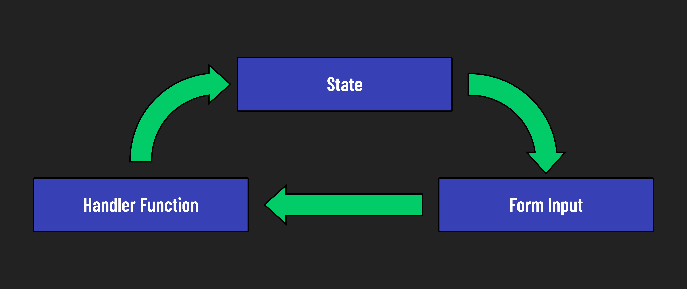
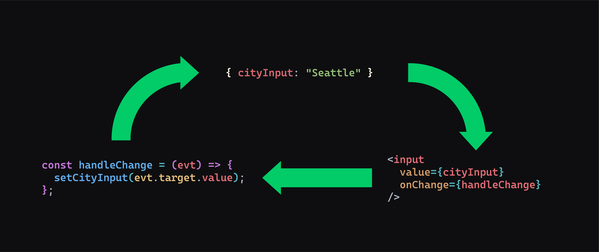

<h1>
  <span class="headline">Controlled Forms in React</span>
  <span class="subhead">Controlled Inputs</span>
</h1>

**Learning objective:** By the end of this lesson, students will be able to understand and implement a controlled input in React by correctly setting up state variables, handler functions, and controlled inputs.

## How controlled inputs work

Before we explore our first controlled input in React, let's examine the key components and understand how they work together.

In React, to create a controlled input field in a controlled form, you will typically need three things:

- **A state variable for the input**: This holds the source of truth for our input's current value.
- **An input value that is tied to state**: This synchronizes the value of an input directly to a piece of state.
- **A handler function**: This updates the state when the input changes.

When we use controlled inputs, the component state is the single source of truth. This ensures that the value of an input is always synchronized with state.



## Building a controlled input

All controlled inputs start life as an uncontrolled input. Ours begins as a single input element that prompts the user for the name of a city:

```jsx
// src/App.jsx

import './App.css';

const App = () => {
  return (
    <>
      <label htmlFor="cityInput">City: </label>
      <input id="cityInput" name="cityInput" type="text" />
    </>
  );
};

export default App;
```

Let's turn this into a controlled input by adding the three requirements piece by piece.

### 1. Add state

We'll start with state by importing the `useState()` hook and adding `cityInput` state:

```jsx
// src/App.jsx

// add an import for the useState hook
import { useState } from 'react';

import './App.css';

const App = () => {
  // construct the cityInput state
  const [cityInput, setCityInput] = useState('');

  return (
    <>
      <label htmlFor="cityInput">City: </label>
      <input id="cityInput" name="cityInput" type="text" />
    </>
  );
};

export default App;
```

The `cityInput` state variable, initialized with an empty string, holds the text input's initial value. It is updated with the `setCityInput()` setter function.

### 2. Add an input value tied to state

Once we have state in place, we can add a `value` prop to our input and set the value of that prop to `cityInput`. In standard HTML, `value` is an attribute of the input element. However, when you're working with JSX in React, these attributes are treated as `props`. Despite the difference in name, there is functionally very little difference for us as we interact with `value`.

```jsx
// src/App.jsx

  return (
    <>
      <label htmlFor="cityInput">City: </label>
      <input id="cityInput" name="cityInput" type="text" value={cityInput}/>
    </>
  );
```

The input field's `value` prop is now bound to the `cityInput` state. This binding ensures that the displayed value in the input field always matches the current state, and is updated in real-time as the user types.

Eventually. Right now, you'll notice that if you try typing anything in this input, it remains blank. Why is this?

Because we're setting the value to state that never changes - let's fix that!

### 3. Add a change handler function

Here's our `handleChange()` function added to the App component. It's in charge of updating the `cityInput` state. Note the input's `onChange` event handler has been set up to use this function:

```jsx
// src/App.jsx

const App = () => {
  const [cityInput, setCityInput] = useState('');

  const handleChange = (event) => {
    setCityInput(event.target.value);
  };

  return (
    <>
      <label htmlFor="cityInput">City: </label>
      <input 
        id="cityInput"
        name="cityInput"
        type="text"
        value={cityInput}
        onChange={handleChange}
      />
    </>
  );
};
  
```

When a user types or deletes a character in the input, the `onChange` event fires off. React automatically sends an `event` object to the `handleChange()` handler function. This object contains information about the event, including the element the user changed, found on `event.target`.

In our `handleChange()` function, we receive this event object as a parameter. The function captures the new value from the input field using `event.target.value` and updates the `cityInput` state by calling the `setCityInput()` function.



We've now built a controlled input and have seen each piece at play!

> ♻️ **Repeatable pattern**: While each piece may become more complex in a more complex application, the three fundamental things required to make controlled inputs won't. You'll always need some kind of state, some kind of user input element, and a handler function that sets state inside it.

Here's our final working app component:

```jsx
// src/App.jsx

import { useState } from 'react';

import './App.css';

const App = () => {
  const [cityInput, setCityInput] = useState('');

  const handleChange = (event) => {
    setCityInput(event.target.value);
  };

  return (
    <>
      <label htmlFor="cityInput">City: </label>
      <input
        id="cityInput"
        name="cityInput"
        type="text"
        value={cityInput}
        onChange={handleChange}
      />
    </>
  );
};

export default App;
```
